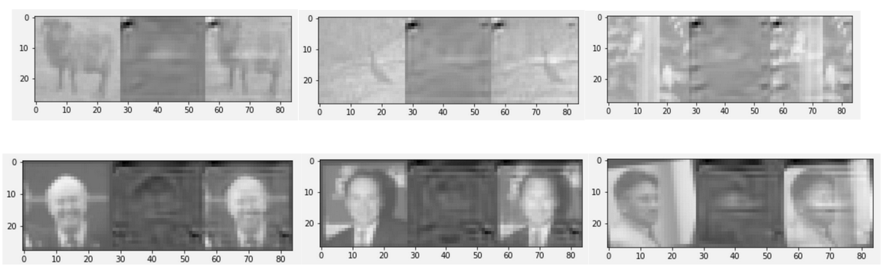

# AdvFaceGAN/DigiFace
CSE455 Final Project

## Abstract

We present AdvFaceGAN, a GAN-driven adversarial framework that
takes partial black-box facial recognition and learns to generate

You can also checkout our website, as well a report

# Setup

1. download LFW or ImageNet

1. Configure proper paths in train/train.py and train/infer.py

1. Train and test

```sh
pip install -r requirements.txt
cd train
python train.py
python infer.py
```

# Results
0.7027 test accuracy on ImageNet

0.7884 validation accuracy on LFW (Labeled Faces in the Wild)



The top row is images from ImageNet

The bottom row is images from LFW

In each of the 6 sets of 3 images, the leftmost image is the original image. The image in the middle is the mask from the generator. The image on the right is the sum of the two images.

# Bibiolography

Our work is greatly inspired by a recent, similar work [AdvGAN](https://arxiv.org/pdf/1801.02610.pdf)
